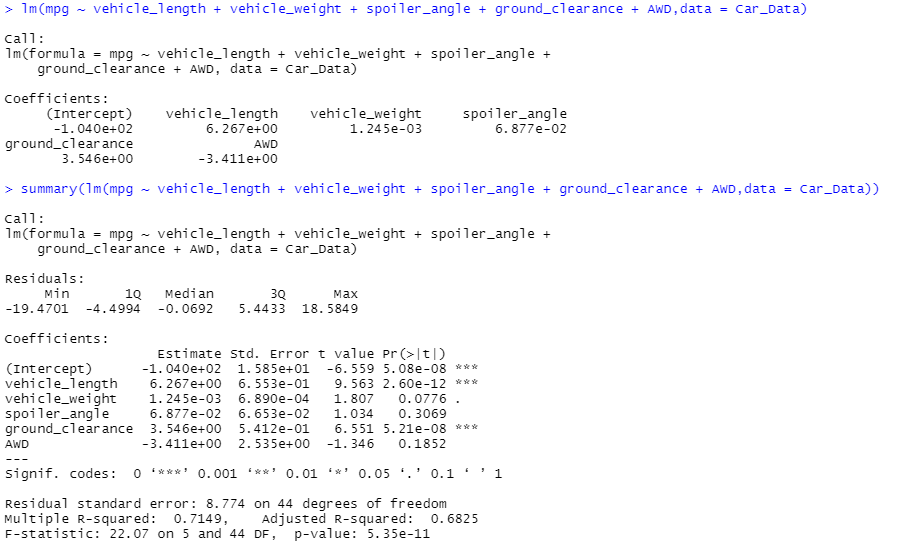
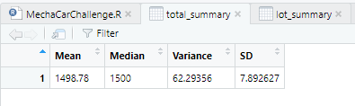
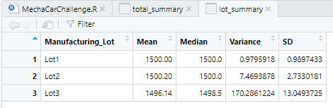
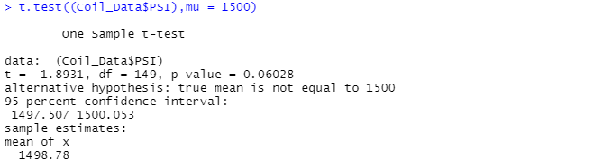
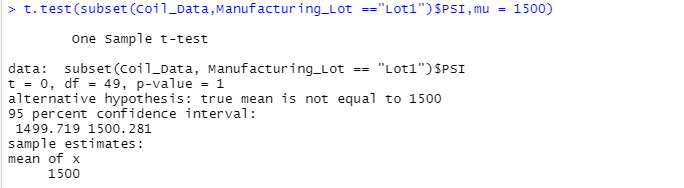
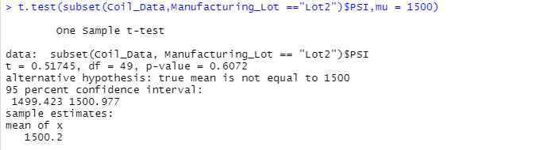
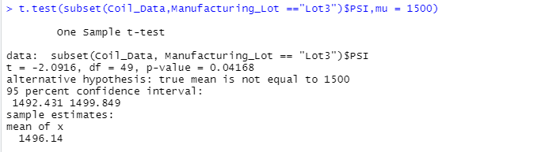

# MechaCar_Statistical_Analysis

## Linear Regression to Predict MPG

- When reviewing which variables provided a non-random amount of variance, we can see that "vehicle_weight","spoiler_angle" and "AWD" meet this criteria.
- The slope in this data is not equal to zero, since the p-value is less than zero (or 5.35e-11 to be exact).
- When looking specifically at the R-squared value, we can see this comes out at 0.7149, which means that for roughly 71.49% of the time the predictions in the lineal model will be accurate, which while this is a good confidence indicator, it could stil be higher.

## Summary Statistics on Suspension Coils

- As shown by the below tables, the total overall variance is 62.29356 which is well below the 100 psi threshold and meets expectations.  However, one of the lots did show potential issue: Lot 3 is well over the 100 psi threshold and came in at 170.2861224 in total, which could to prove be problematic being this high.

## T-Tests on Suspension Coils

- For all manufacturing lots in total, they're not statistically different from the total population mean, and specifically the p-value is not low enough to reject the null hypothesis.  The p-value was 0.0603 and to reject would need to be below the significance value of p = 0.05.

- For lot 1, they're not statistically different from the total population mean, and specifically the p-value is not low enough to reject the null hypothesis.  The p-value was 1 and to reject would need to be below the significance value of p = 0.05.

- For lot 2, they're not statistically different from the total population mean, and specifically the p-value is not low enough to reject the null hypothesis.  The p-value was 0.6072 and to reject would need to be below the significance value of p = 0.05.

- For lot 3, this manufacturing lot should slight statistical difference from the population mean, and the p-value was low enough to reject the null hypothesis.  The p-value was 0.0417 and to reject would need to be below the significance value of p = 0.05, so this came in just under the significance value.

## Study Design: MechaCar vs Competition

As newer vehicles become more fuel-efficient at a much more affordable cost, most consumers now turn their attention over to safety rating as one of the most important factors when considering pruchase of a new car. 

- Metric to Test: We should look at safety ratings of MechaCar vehicles against the safety ratings of vehicles made by other car manufacturers. 

- Null and Alternate Hypothesis:  The null hypothesis we would like to test for is that MechaCar vechiles don't have safety ratings that are significantly higher than vehicles from other manufacturers, while the alternative would be that MechaCar vehicles do have safety ratings that are significantly higher statistically.

- Statistical Test Used: A one-tailed t-test should work for this analysis to see if there's any difference between both groups.  A two-tailed t-test would not be necessary here, as there should really only be a possibility of an effect in one direction.

- What Data is Needed?: To run this analysis, we'll need data from MechaCar vehicles and their safety ratings respectively for each, and compare these against the same safety rating data but for other cars and their respective manufacturers.

